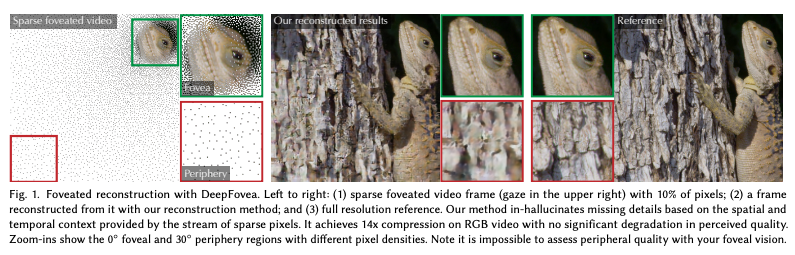
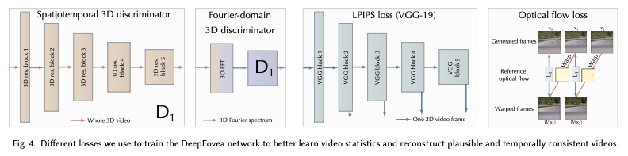
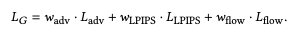
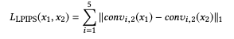
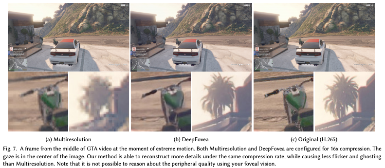
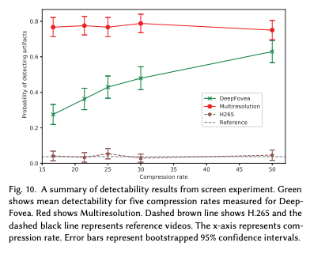
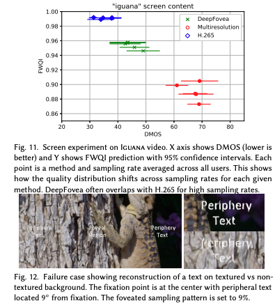

# DeepFovea

现代代的显示系统利用头戴式，高分辨率，低延迟以及高刷新率提供给用户一个沉浸式的视觉体验。这对计算力提出一个挑战。于此同时，人类的视觉系统由于外围视觉的剧烈衰减只能利用视频流中的一小部分内容。Foveated rendering and compression可以通过降低外围区域的图像质量来减少计算量，但是同时会造成引人注意的artifacts；如果采取比较保守的方法又只能有很少的收益。作者提出了一种新的Foveated reconstruction的方法，利用每一帧提供的一小部分像素通过GAN，重建视频的边缘，从每一帧提供的一小部分像素。作者将重建问题表示为投影到流形的问题，找到与所有自然视频流形上的稀疏foveated input最接近的对应的视频。作者的方法比之前的Foveated rendering更加高效，同时质量的退化也更少，使用User Study来验证方法。作者的方法也足够快，能够驱动gaze-contingent HMD。同时计划公布网络作为foveated rendering和压缩的quality bar。

使用一个随机foveated video作为输入，这个输入要足够一般化来覆盖各种用例。作者使用一个稀疏的视频流，每帧只有一小部分像素随机分布。对于普通的视频，作者使用一个简单的压缩器，根据人类的视觉敏锐度随机地将外围像素丢弃。

+ 一种新颖基于神经网络的重建方法，可以产生暂时稳定的边缘视频内容。
+ 支持由任意方法产生的视频内容。
+ 超过14倍的压缩而没有明显的质量下降。
+ 实时、低延迟重建，支持gaze-contingent display。
+ gaze-contingent user studies。
+ 作为foveated compression Baseline。

## Previous Work

与大多数中心渲染方法相比，作者设计的重建方法，它不需要知道图像是如何生成的，作者的系统是建立在统计上的。这样能够用一个统一的方法处理视频和图像。

H.264、H.265等流行的标准也不直接适用于中心凹视频压缩。随着鱼眼摄像头和VR的出现，360度视频格式越来越受欢迎。通过利用眼睛和头部的跟踪，只需要在全分辨率下解码整个场景中被观看的部分。

最近关于学习感知图像Patch相似度(Learned Image Patch Similarity, LPIPS)的工作[Zhang等人，2018]使用校准的感知度量，将重建图像和目标图像通过预先训练在ImageNet数据集上的VGG网络[Si- monyan和Zisserman, 2014]传递。这个最近的度量被证明在各种扭曲上有很好的感知性能。作者使用这个指标作为训练损失和消融研究的图像指标之一

只有少数几个质量指标被设计用于foveated image的质量评价。Foveated小波图像质量指数(FWQI)。

高质量的图像和视频遵循常规的自然场景统计[鲁德尔曼1994]。人类的视觉系统已经适应了这些统计数据，并在推断周边细节时严重依赖这些数据。因此，学习这些统计数据可以使更强大的感知压缩方法成为可能。

## Problem Setting

为了减少这种工作量，可以绘制了每帧所需像素总数的一小部分，并根据作者的模型推断出其余部分。

**Sparse Input**

为了减少编码信号所需的比特数，使用sparse randomized mask下采样。减少采样数量，压缩率就会提高。通过根据视网膜的细胞密度布局构造这个Mask。

对于源视频帧的每个像素位置x，作者首先计算采样率R(x)∈[0;1]根据最大可感知频率、显示器的几何设置和所需的压缩率。详见补充资料。

对于每一帧，使用一个NxM二进制掩码M，其中$M(x) = 1_{R(x)>U}$，其中U是一个有界的随机变量[0,1]，它遵循某种均匀的随机分布。作者使用了一个蓝噪声序列。然后根据该掩码选择帧的有效像素，并将掩码本身作为重建的输入。作者还测试了其他的采样方式，包括均匀随机抽样，然而重建的质量会有下降。这个Mask在每一帧是不同的，因此可以累积更多内容。

重构网络的基于一种流行的U-Net结构。为了使网络能够利用帧间的相关性，添加了recurrent layers。为了让结果在时域上，添加了如光流和时域正则化。

**Design Goals**

作者的目标是：能够重建当前的帧仅基于过去的帧，且能够实时运行。

这禁止使用复杂的模型或大量数量的过去或未来帧。

人类的视觉系统对周围环境中的高频细节并不敏感，然而，运动和闪烁很容易被探测到。网络需要在及时引入新内容的同时需要抑制输入噪声引起的闪烁。

## Neural Reconstruction

对于作者系统的重构网络G(图3)，作者选择了U-Net with skip connections。作者选择了ELU激活函数。

为了生成时域稳定的，同时保持网络简单，作者设计进行了一个简单的convolutional recurrent layer。ELU可能会带来一个无限正反馈。需要格外注意处理时域的稳定性。

递归块能够处理注视引起的像素密度的突然时间变化。训练网络时用恒定密度的视频，同时随机采样minibatch中每个视频的密度就足够了。在高密度区域，存储了大量的细节信息。当凝视者离开该区域时，会随着时间的推移平滑地降低该区域内的高细节信息。重建中心由于skip connections总是高质量的。

卷积递归块由于其核的接受域限制，不能有效地处理较大的图像空间距离。作者重新设计了隐藏状态，以补偿大规模的横向运动，以协助网络在HMD设置中的头部旋转。作者分析计算了每个递归连接的光流，使用了最后一个和当前帧的两个视图矩阵来执行重投影。作者将每个隐藏状态视为具有多个通道的纹理。如果最后一个位置在隐藏状态2D边界之外，则保留当前texel值。

### Losses

Loss分成四个部分。

#### Adversarial loss

对抗性损失是由一个鉴别网络来建模的。鉴别器允许学习自然视频的时空流形，通过提供感兴趣的分布和其他可能的视频之间的边界。鉴别器一次处理整个视频序列，因此可以推断时空关系并分析时空动态。鉴别器的目标是将视频分为伪视频(由生成器构造)和真视频(从数据集采样)。
作者使用Wasserstein GAN (WGAN)设计[Arjovsky等人，2017]，由于其强大的损失功能，稳定了训练。作者使用3D卷积网络D1作为Wasserstein测度(见图4)，并使用最近的光谱归一化GAN (SN-GAN) [Miyato et al. 2018]来确保1-Lipschitz连续性。sni - gan支持视频上的快速训练，同时提供更稳定的对抗性训练。
该网络D1为三维漏斗结构，由剩余块组成[He et al. 2016]，其空间尺寸逐渐减小。网络作为输入对整个视频进行操作。为了能够充分分析时空特征，作者使用了3×3×3个时空核的三维卷积层。每个块包含两个3D卷积，然后是对空间维度和时间维度进行平均的3D平均池操作。作者使用ELU作为激活函数来允许鉴别器从稀疏状态中恢复，这减少了训练崩溃的机会。为了使网络专注于细节，而不是将视频缩减为单个标量值，作者遵循PatchGAN损失[Isola et al. 2017]，并要求网络对生成的视频的局部补丁进行分类。（？）

WGAN设计的一个固有假设是鉴别器应该是1-Lipschitz连续的，即∀x1, x2: | (x1)−f (x2) |≤x1−x2 | |。标准网络通常违反这个约束。有几种方法可以确保1- Lipschitz连续性。作者在鉴别器[Miyato et al. 2018]中使用了最近的谱归一化，在每一次更新W之后都除以W最大的奇异值。消除收敛问题

####  傅氏域鉴别器。

三维傅里叶域中引入了闪烁检测。首先进行傅里叶变换，然后，使用一个D1网络来学习自然视频的流形。由于不再有图像补丁，作者将两个完全连接的层分别附加上256和1个单元，其中一个ELU被激活。这有助于了解自然视频中出现的时空频率的结构。特别是，这种损失有助于检测非自然的噪音和闪烁。

#### Perceptual Spatial Loss

为了提高检索帧与源帧之间的相似性，使用校准感知缺失(LPIPS) [Zhang et al. 2018]。通过最小化LPIPS，作者的网络学会赋予每个重建的视频帧以自然图像统计。这在为重建提供足够自由的同时，也引导了对抗训练。经过预处理的VGG-19由五个块组成，每个块对应于初始图像的不同抽象级别。作者从每个块中取出conv2层的输出作为特征提取器:

然而，这个损失函数只改进了空间(帧内)特性，
同时不提供帧之间的时间关系。为了让它配合时空损失，并通过重复连接来鼓励梯度流，作者指数地降低了视频前八帧的损失。

#### Optical flow loss

光流在视频生成中的应用有多种：一种是直接在发生器中估算光流，要求发生器与目标光流匹配，然而，这增加了网络的复杂性。受最近视频超分辨率工作启发(Perez-Pellitero et al . 2018年),应用光流的只在训练要求网络匹配重建帧与先前的重建帧。

### 训练细节

#### 网络参数

在作者的网络中有五个编码器模块。每个连续的编码器块两次缩小输入空间维度并增加特征数(图3)。一个编码器块由两个3x3卷积和ELU激活组成。第二个卷积层之后是平均池化层。一个块中的两个卷积层具有相同数量的Filter（每个块具有32-64-128-128个过滤器)。瓶颈块以较低的空间分辨率处理最后一层编码器的输出，并在高级图像语义上进行操作。它与最后一个编码块相同，不同之处是它对输入进行向上采样，并且没有跳过连接。
每个解码器块由一个带有递归式的3x3卷积层(见下一段)、第二个空间3x3卷积层和一个双线性上采样层组成。每个层后面都有一个ELU激活。循环层的输出在激活之前经过层归一化。解码器块与相应的编码器块具有相同数量的卷积滤波器(128-128-128-64-32)。对称填充被广泛用于防止图像边界上的边界工件。

#### 视频数据集

作者对从视频数据集中采样的视频进行训练，该数据集包含各种自然内容，如人、动物、自然、文本等。每个视频的分辨率高达640x480和150帧。对于每个视频，作者使用FlowNet2网络预先计算光流。接下来，视频缩小到128x128，以满足GPU内存限制。最后，视频被分割成32帧长、8帧重叠的块。训练集中的视频序列总数约为350,000个。在训练过程中，每个32帧的视频片段都加上随机二进制掩码。

#### 超参数

训练使用标准的方法，交替更新生成器和识别器，每个网络更新一次。网络G开始在每帧中使用10%的有效像素进行训练，在前两个时epoch，这个百分比逐渐降低到1%。使网络在培训过程的开始学习更快。作者用wadv = 1、wLPIPS = 100、wflow = 20，以大致均衡它们的大小。作者用ADAM optimizer，β1 = 0,β2 = 0.95 训练30轮和学习率3e-4。

#### 稳定一个经常性的视频网络。

在测试阶段发现网络在长视频上是不稳定的，会变成一个恒定的彩色视频。作者使用几种技术来稳定复发连接。首先，作者将recurrent layer做归一化使activations有界。其次，作者以一种有状态的方式来训练RNN，即，隐藏状态从一个迷你批处理保留到另一个迷你批处理。这使得每个循环层都可以从隐藏激活中合理的内容开始，这些隐藏激活在训练期间处于当前的工作范围内，这有助于网络在很长的视频推断时间内保持稳定。在最开始的训练,作者使用零初始化隐藏状态——意味着高斯噪声和σ= 0.02。这些改进通过防止推理过程中的激活爆炸来帮助循环设计的稳定性。

### 消融实验

为了验证网络的设计选择，作者进行了消融研究。作者分析了网络的容量、深度以及这些损失对最终结果的影响。作者使用FWQI度量来确定重建的空间质量。由于FWQI只检测单个帧中的空间重建伪影，因此无法测量周边视觉中的时间伪影，如闪烁，这对周边重建质量至关重要。据作者所知，关于这方面的度量，因此，作者在补充材料中提供了样本视频。

#### 网络深度。

实验结果表明，该网络有效地避免了网络块数目的增加。随着U-Net块的从1到3增加，FWQI值先急剧增加，然后从3个到5个变得稳定。所有的网络都有相似数量的参数(大约3M)。一种解释是由于输入的稀疏性，网络受益于感受野的增加。作者在最终设计中使用了5个关卡。

#### 网络容量。

Filter的数量每层增加一倍，并设置128个为上限。图6显示当第一层的Filter从8增加到16时，FWQI增加。该指标在24和32值时保持稳定增长，而在48个特征值时趋于稳定。为了约束网络的推理性能，作者选择32作为最终设置。

#### Loss。

作者比较了网络的多个变体，分别启用LLPIPS、LLPIPS +Ladv、LLPIPS +Ladv +Lflow。不幸的是，FWQI并没有提供有意义的比较，甚至在这个过程中还会下降。它不考虑时间稳定性，而时间稳定性是Ladv和Lflow损失的目标。

不出所料，LLPIPS只允许网络学习单帧重建，留下大量的闪烁。

对抗损失Ladv显著地改善了时间稳定性，抑制了大部分的闪烁。

光流损失Lflow提供了一个额外的改进，并减少了时域噪声。

##  结果

主观评分标准化的dmos考虑了主观变异性和对不同内容类型的感知。Seshadrinathan等人[2010]更详细地描述了DMOS的计算。作者还为每个视频计算FWQI和FA-SSIM中心质量指标。为了分析主观评分和误差度量之间的相关性，作者计算了斯皮尔曼等级相关系数(SRCC)和线性相关系数(LCC)。

图显示了屏幕实验的摘要图。HMD结果见补充资料中。为了比较其他方法与DeepFovea的结果，作者将DeepFovea的采样率转换为压缩率，取采样率的倒数。对于多分辨率，作者计算每个区域的像素数，然后除以总像素数来计算采样率，然后使用相同的转换过程来获得压缩率。图中显示了测试的五种压缩率的所有方法的平均可检测性。附录中提供了每个受试者每个实验的附加图。

根据用户研究的结果，DeepFovea在37x压缩率下实现了50%的伪影检测。总的来说，深度中心凹在所有采样率上的表现始终优于多分辨率，这表明，相比之下，深度中心凹的表现明显更好，即使在低压缩率下也是如此。另一方面，同心H.265在所有采样率上与参考值没有显著差异。接近15x压缩时，深凹更接近H.265的可检测性，因此可作为参考。尽管H.265使用100%的像素对每个压缩率进行最佳编码，但DeepFovea开始接近H.265，并且仅使用9%的有效像素来参考性能。

对于HMD实验，深凹始终低于50%可检测性。总的来说，DeepFovea在所有压缩率上的表现始终优于多分辨率，这与屏幕实验结果类似。与screen实验相似，H.265与参考文献没有显著差异。对于HMD，深凹在伪影可探测性上有了显著的提高，与H.265相当，因此，在25倍压缩率下的参考，这意味着在这个压缩率下，伪影平均变得无法探测。主观评分与作者的可探测性研究结果一致。

显示了“iguana”视频的FWQI和DMOS，这代表了其余的内容。低DMOS意味着更高的视觉质量评级。综上所述，较高的压缩率降低了视觉质量，这可以通过较高的DMOS分数反映出来。补充资料中提供了更全面的细目。来自屏幕和HMD实验的DMOS表明，深凹产生的结果明显好于多分辨率。当单独考虑每个内容时，主观评分表明，与多分辨率方法相比，深凹通常产生更好的视觉质量。DeepFovea使用一个大型的学习先验从稀疏视频进行时间重建，抑制闪烁和重影伪影。因此，与多分辨率方法相比，该方法可以获得更好的结果。
