# The design and evolution of the UberBake light baking system

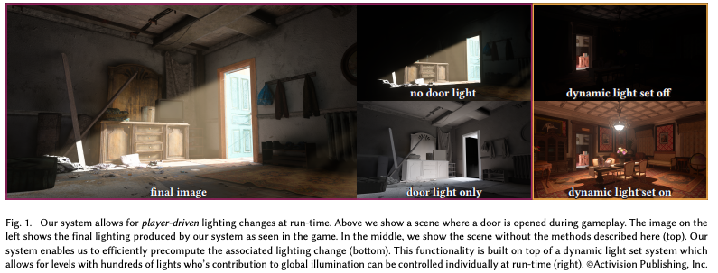

UberBake是一款由动视公司开发的GI系统，它支持有限的光照变化以回应特定玩家的互动。作者不使用完全动态的解决方案，而是使用传统的静态光照烘培流水线，并扩展它，使作者能够在运行时以最小的性能和内存开销动态更新预先计算的光照。作者展示了如何有效地预先计算由于单个灯的启用和禁用以及门的开启和关闭而引起的光照变化。

# 概述

渲染过程的难点之一是计算全局光照。考虑到有限的时间预算，大多数现代游戏引擎都依赖于某种形式的预计算或烘焙。

UberBake是在多次发行的过程中开发出来的。作者工作的核心观点是，作者可以选择影响光照(启用/禁用灯和打开/关闭门)的用户交互的有限子集，有效地预先计算与每个交互相关的光照变化，并使用最小的额外内存。

## 设计标准

作者在设计时考虑了以下几个准则：

**C.1 接近于零的运行时开销**

作者希望在各种各样的硬件上发行60帧/秒的游戏，从现代游戏pc到控制台和智能手机。

**C.2 没有附加的几何约束**

当作者实现作者的系统时，已经有了大量的内容。因为重做大部分内容是不可行的，所以系统必须在只需要少量级别更改的情况下工作得很好。

**C.3 引擎和工具代码没有重大修改**

作者在现有的工具上投入了大量的工程和艺术资源，不能对它们进行显著的改变。

作者同时也努力优化以下设计目标。

**M.1 最小化艺术家的迭代时间**

**M.2 最小的内容创建开销**

**M.3 最大化实现正交性**

## Existing and Alternative Solutions

P.S. 可参考之前的报告

Real-time Light Transport (dynamic lighting and geometry).实时光传输方法以运行时性能为代价，以最小的预计算支持动态光照和几何图形。在给定C.1和C.3约束条件下，在多光环境下实时路径跟踪和解决大量可见性问题仍然是不可行的。使用简化的场景体积表示是将几何体与光照计算解耦的常用方法，以减少光照和能见度计算时间，同时支持动态几何和光照。除了可观的运行时成本外，体积光传输方法的主要缺点在于用于光照的简化场景表示与场景几何形状之间的不匹配。实现没有泄漏或插值的一致性光照仍然是一个挑战。

Precomputed Light Transport (dynamic lighting, static geometry).预计算光传输(PRT)方法允许动态环境光照，同时保持运行时成本低。对场景几何结构施加了限制，在作者的环境中限制太大(C.2)，或者性能成本太高(C.1)。

Precomputed Lighting (static lighting and geometry).限制光照和几何图形是静态的，自然，运行时成本最小，并且是游戏制作中最常见的全局光照形式。通过预先计算多个光照场景并在运行时以增加的流存储成本为代价在它们之间插入，可以支持有限形式的动态光照。这些方法在光线变化有限且不受玩家控制的情况下非常有效，例如在改变一天的时间时。作者的全部动机是支持玩家驱动的光照改变到一个大的互动元素集。使用现有的技术将很快耗尽作者的内存预算，而为响应玩家输入而提供一套全新的光照是不可行的。

## Summary and overview

在性能约束下，没有任何一种现有的方法能够轻松满足作者的设计目标。因此，作者开发了自己的系统，基于预先计算的光照，使用混合的体积和光照映射表示，以获得最大的性能，同时支持动态几何变化，通过有效的本地光照更新。

“动态灯光设置”(DLSs)使作者能够根据玩家的动作打开或关闭几组灯光(章节3)，并相应地更新它们对全局光照的贡献。最后，在第4节中，作者扩展DLSs来处理光照中的非线性变化，比如打开和关闭门所产生的变化

# 方法

作者的光照解决方案有四个部分:
+ 作者如何表示(2.1节)光照
+ 作者如何存储(2.2节)光照
+ 作者如何预计算全局光照(2.3节)
+ 以及作者如何使用预先计算的数据将全局光照阴影中静态和移动对象(2.4节)。

## 光照表示

当为作者的光照数据选择表示时。作者不仅要决定如何存储光照值，而且首先要决定存储哪些光照。

Path notation.
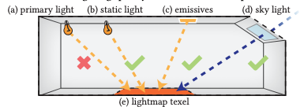

主光源LP (a)是作者系统中最常见的光源。对于这些，作者只烘焙间接光照，直接光照是按每像素的运行时计算的。
艺术家也可以放置静态光LS (b)，直接光照也可以被烘培。此外，作者还支持从发光几何体LE (c)。发光几何体指的是是有发光材质的三角形。
最后，来自天空LSky (d)的任何光照也将被烘培。

## 光照存储

作者的存储方法由以下几个部分组成：

### Directional lighting encoding.
作者利用球面谐波编码存储入射辐照度。

### Lightmaps.
在light map的格式选择上，作者使用了一种环境高光方向(AHD)编码。light map的空间分辨率由艺术家决定，以适应规定的内存预算。

### Local Light Grids (LLGs).
作者使用一种作者称之为“局部光网格”的数据结构，这是由Iwanicki和Sloan首次提出的，目的是提供volume light map的一种替代。LLGs不尝试在物体表面存储光照值，而是将它们存储在模型周围的SH probe中。虽然Iwanicki和Sloan使用的是四面体网格，但作者决定使用更简单的欧几里得网格，以更快地查找。

这种容量存储方法的主要问题是，可见性变化会引入的高频细节，这些无法被SH捕捉到。因此，LLGs通过为每个模型顶点存储一个额外的自可见性项来解决这个问题。

### The Global Light Grid (GLG).
虽然系统中的动态对象不会影响全局光照，但作者仍然希望预先计算的全局光照能够影响移动的人物、车辆和粒子效果。因此作者引入了GLG，它允许作者在空间的任意点采样间接光照。GLG的分辨率在地图上是可变的，并根据光照本身的分布和可用的游戏相关信息(例如，可玩区域分配更高分辨率的GLG)自动确定。密度最高为每1.0米一个探针。作者使用分布在整个地图使用一个四面体网格状probe。每个probe探针(包括GLG和LLG)以三阶球面谐波(SH)的基础存储辐射。这样，光照查找的运行时实现对于静态和动态对象都是相同的。

## 光照预计算

作者的预计算使用MCRT方法对光照进行与计算。这部分就不赘述了。
## 运行时光照更新

在本节和接下来的章节中，将介绍作者如何扩展这个系统以允许玩家驱动的动态光照更新。
## Dynamic Light Sets

作者把一组可以用户控制的灯称为DLS。
在基础烘培中，DLS中的任何灯光都会被忽略。

在运行时,每个DLS都有一个关联的混合重量,ω。这个权重由DLS的平均强度决定。例如，考虑一个包含两盏灯的动态灯光组，每盏灯都以全强度照亮走廊。当其中一个是关闭的(它的强度设置为0),那么ω= 0.5。因此他的计算是一个线性的公式。

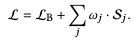

作者接下来对该方法进行了一些优化，以便让系统支持上百个dls。

### DLS的稀疏存储方法

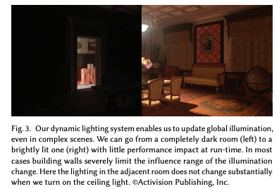

实际中，DLS只对一个有限的区域有显著的贡献，如图所示。为了利用这一点，作者使用稀疏的数据结构来存储动态灯光集的灯光值。基础烘培首先运行并存储所有接收者的数据，然后确定一个阈值(作者使用平均光照的1%)。任何接收器（可能时probe也可能时texel）收到的光照高于阈值时记录该DLS。对于每个接收器，作者存储一个索引，指向接收器在基础光贴图中的位置(对于texels)或GLG中相应的探测(对于GLG探测)。
###  运行时着色计算

运行时的着色计算方法必须考虑到：

(1)作者的解决方案必须是高效的GPU，这意味着可变的数据结构是不合适的。

(2)由于作者的数据非常小(每个lightmap texel 8字节)，作者必须保持使用的数据结构的内存开销很低。即使只是为每个texel存储一个额外的索引(4字节)，内存存储也会增加50%。

(3)常见的情况是DLS完全关闭，作者需要能够有效地跳过这些DLS的计算。

(4)类似地，作者需要能够跳过没有变化的dls的texel的更新。

(5)如果可能的话，作者想直接更新最终资源，避免的带宽开销。

作者首先在预处理步骤中根据受到哪些DLS的影响对texel进行聚类。这给了作者一个DLS组合列表，每一组都有对应受影响的texel。然后在计算中，对于一组DLS组合需要更新的，texel都是相同的。这意味着作者不需要可变长度的数据结构，每个texel不存储冗余数据，同时很容易没有改变或者没有作用的DLS。每个texel只属于一个DLS组合，因此一次更新只需要修改一次。

#### 改进

在开发第一款游戏时，设计师们被要求将DLS的数量保持在个位数，并且作者增加了专门的着色器的数量来处理被多达8个动态光设置影响的纹理。作者引入了两个机制进行处理:

(1) 对于少于128个texel的DLS组合，将这些组合打包，知道组合中DLS的数量为5个，这样可以减少GPU dispatch的数量。

(2)加入两个计算定长DLS的着色器，一个用于5-8个DLS组合的，一个用于9-16。这样的好处是可以在进一步减少存储DLS组合数量的所用变量的大小。

#  MULTI-STATE GEOMETRY

作者试图上述方法扩展到更加复杂的场景，例如打开和关闭门的情况。下面作者将介绍如何扩展DLS系统，使之能够在不过度影响烘焙时间的情况下支持动态门。

## Doors as dynamic light sets

方法也很简单，作者将门作为DLS的一个附加组件，记为：SP,通过当前的门的张角ωP来控制强度。

 为了实现这一点，作者做了几个简化假设。
（1）门只有开和关两种状态。（2）作者不考虑任何在门反射的光线。

在有门的情况下，一扇门是否打开会非线性地影响光从动态光组和其他门的传播。为了得到n个DLS和m个门的情况下的正确结果，作者必须烘焙所有(1+n)2^m种状态组合。所以作者假设对于每一个动态灯光设置和门的组合烘培时，所有其他的门都是关闭的。这将组合的数量减少到只有(n + m + 1).当然，所有这些简化都会在某些情况下导致artifacts，但是作者不考虑这些问题。

## Efficient sampling techniques

为了减少烘培时间，作者将光照路径限制在特定的路径子集中，作者观察到这些路径对整体光照的贡献最大。作者计算直接光和第一次反射。

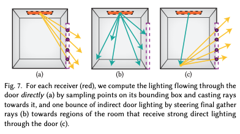

The door as an area light source. 

对于靠近门的接收者，许多贡献路径为LD+PR形式。作者使用重要度采样的方法，第二个Path会根据门的位置做importance sampling。

Clustered shadow photons for path guiding. 

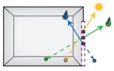
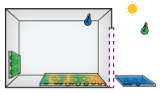
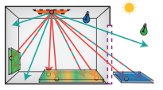

在这一步，会类似Photons mapping的方法发出一系列光子，并构建boundingbox。这些boundingbox可以当作一种area light计算间接光强度。

Direct light culling

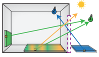

为了进一步加快烘焙过程，
在这一步，会类似Photons mapping的方法发出一系列光子，并构建boundingbox，每个boundingbox会标记光子的来源，这样在采样时，可以根据光子的来源做重要性采样。

## result

结果见图

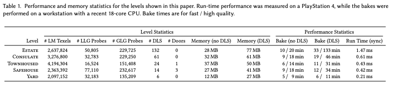

烘焙时间和运行时开销都得到了保证。

## limitation

缺点在于，由于门只有开和关两种状态，因此会有artifacts。

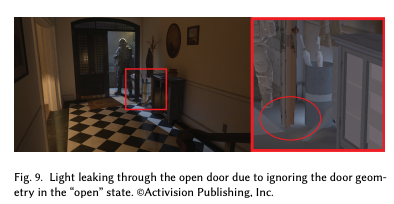

其次，在多扇门的情况下最里面的房间会接受不到光光照。由于计算光照时其中一扇门会处于关闭状态。

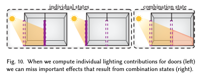

这些情况需要艺术家手动制定光照的情况来处理。